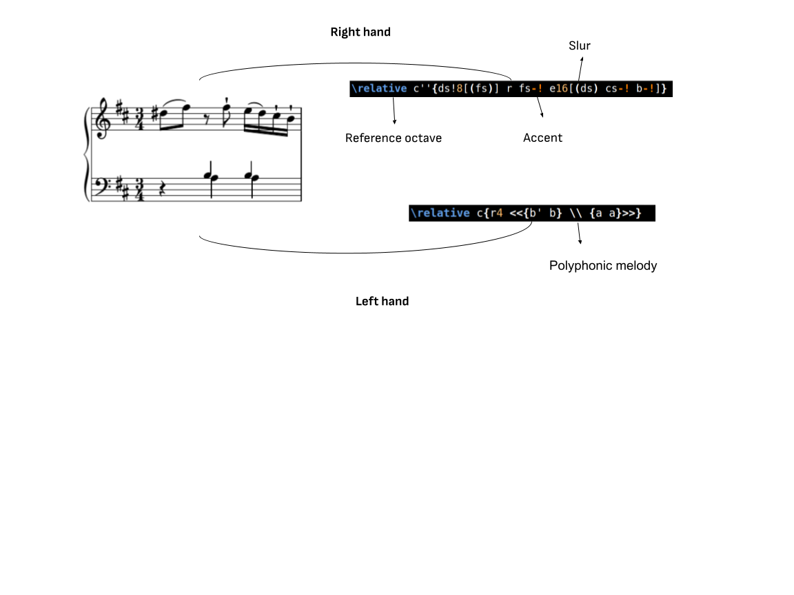
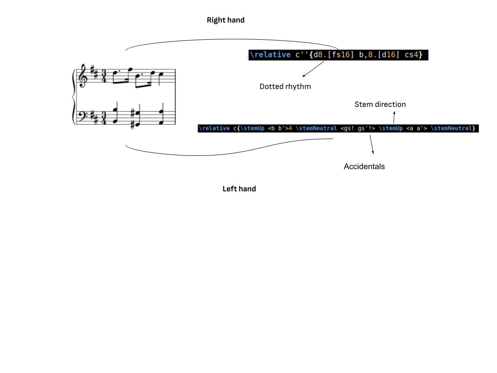
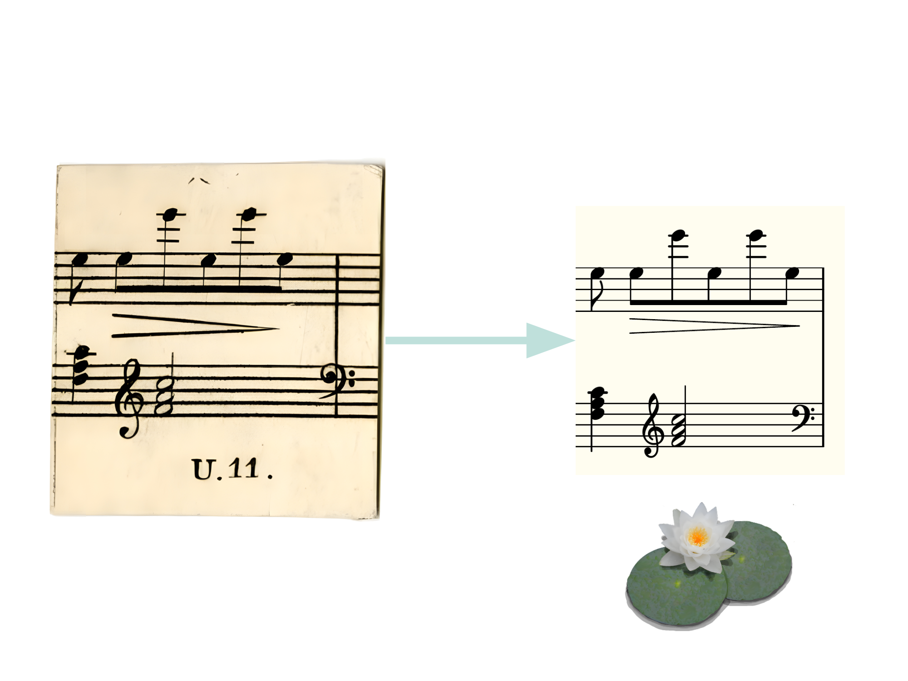

# Technical Report

This technical report is complementary to the upcoming paper _Who’s Afraid of the ’Artyfyshall Byrd’? Historical Notions and Current Challenges of Musical Artificiality_, submitted by the authors and accepted for [ISMIR 2024](https://ismir2024.ismir.net/accepted-papers).
We wish to present an Optical Music Recognition dataset of musical dice games (_würfelspiele_ in German) digitally transcribed and implemented using the music engraving format [Lilypond](https://lilypond.org/) and related [Abjad Python module](https://abjad.github.io/). 

The peculiar engraving of these musical dice games could be exploited to generate robust ground truth and evaluation of OMR models, both for printed and handwritten musical scores. Infact, the music scores of these treatises are organised in fragments, usually consisting of a whole musical bar, that are labelled with combinations of numbers and/or letters.

## Lilypond in OMR Research

Despite the excellent control of music engraving and human-friendly syntax, the possibilities of the Lilypond format have not yet been widely implemented and recognized within the OMR community. This report wishes to share some aspects of the transcription pipeline of the music, proving the efficiency and quality of the Lilypond digital encoding and its feasibility for a human agent.

According to the [Optical Music Recognition Datasets page](https://apacha.github.io/OMR-Datasets/) (retrieved in October 2024), only 2 of the 33 datasets support the Lilypond format in contrast with MusicXML and MEI.
Lilypond is a markup language for music engraving similar to LaTex that has developed an intuitive syntax for encoding musical scores. 

In the following examples, we wish to illustrate how the language deals with Western music scores, from notating pitches and durations to encoding symbols concerning performance practice (such as trills, articulation and dynamics), note clusters and polyphonic lines and even beaming and stem direction. 

It results that the digital engraving is extremely faithful to the original score, reducing any discrepancy between the encoding and the real object recorded on the image to a minimum.

Example of how Lilypond ecodes musical articulation, such as accents, slurs and beams. Furthermore, the example shows the syntax for polyphonic lines within a staff.

Example of how Lilypond econdes rhythmn, note clusters, accidentals and stem direction.

## Dataset

The Artyfyshall Byrd GitHub repository provides several resources and code:

- **images-treatises** contains all digitised scans of the musical treatises in JPEG and PDF format.  
- **code-implementation** stores digital implementations of the treatises' procedures, generating musical scores in the **code-implementation/treatise-directory/output** folder related to the musical work.   
- Layout and Staff options in Lilypond and text format to guarantee uniform layout and engraving of the scores.  
- Transcription of each fragment (usually a bar) in Lilypond, MIDI and PDF formats. The code for each contrapuntal voice is stored separately in a dedicated subdirectory.  
- A Python script with the suffix “generation” to automatically format the input transcription in separate Lilypond files.

Here an example of the directory structure for Antonio Calegari’s *Gioco Pitagorico* version 1, for soprano and piano:

- Images and PDF at **image-treatises /Calegari-Gioco-Pitagorico-Musicale(1801)**  
- Digital implementation at **code-implementation/calegari-1801-01.py.** Generated output can be found in **code-implementation/calegari-1801-01/output**  
-  The layout and voice option files are in **code-implementation/calegari-1801-01/**  
- Transcription files are named as **code-implementation/calegari-1801-01/gp-01-n.ly** where n is the barnumber in the treatise. Separate melodies are stored in the **code-implementation/calegari-1801-01/voice** (soprano) and **code-implementation/calegari-1801-01/lh** and **code-implementation/calegari-1801-01/rh** for the piano part.  
- The Python script **code-implementation/calegari-1801-01/gp-01-generation.py** has generated all the transcription files of the treatise.

Not all treatises in the Artyfyshall Byrd project are formatted in this manner, for the purpose of this report we are only considering the following treatises:

|  |  |  | total | 1389 |
| :---- | :---- | :---- | :---- | :---- |
| **Title** | **Composer** | **Version** | **Instrumentation** | **number of transcribed bars** |
| *Gioco Pitagorico* (1801) | Antonio Calegari | 1 | soprano, piano | 198 |
| *Gioco Pitagorico* (1801) | Antonio Calegari | 2 | 2 sopranos, piano | 264 |
| *Der allezeit fertige Menuetten- und Polonaisencomponist* (1767) | Johann Philipp Kirnberger | 1 | *polonaise* for 2 violins and harpsichord | 154 |
| *Der allezeit fertige Menuetten- und Polonaisencomponist* (1767) | Johann Philipp Kirnberger | 2 | *menuet* for violin and harpsichord | 96 |
| *Kaleidakunstikon* (c. 1820\) | Friederich Kulhau | 1 | keyboard instrument | 231 |
| *Gioco Filarmonico* (1793) | Joseph Haydn (attr.) | 1 | keyboard instrument | 176 |
| *Gioco Filarmonico* (1793) | Joseph Haydn (attr.) | 2 | keyboard instrument | 96 |
| *Englische Contretänze mit zwei Würfeln* (c. 1790\) | Wolfgang Amadeus Mozart (attr.) | 2 | keyboard instrument | 174 |

